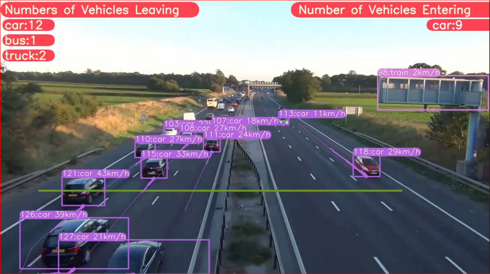

### Author: 
### https://github.com/MuhammadMoinFaisal/YOLOv8_Segmentation_DeepSORT_Object_Tracking  
### https://www.youtube.com/watch?v=nkptX_vXJKo
<H1 align="center">
YOLOv8 Object Detection and Speed Estimation with DeepSORT Tracking (ID + Trails) </H1>

## Original (Author) Google Colab File Link (A Single Click Solution)
The google colab file link for yolov8 object detection and tracking is provided below, you can check the implementation in Google Colab, and its a single click implementation, you just need to select the Run Time as GPU, and click on Run All.

[`Google Colab File`](https://colab.research.google.com/drive/1nPGcKGB2ZGO1s8qlflXoWVpIkMlT2J5L?usp=sharing#scrollTo=WkR9WDjCEn18)

## Our Google Colab File Link (A Single Click Solution)
[`Google Colab File`](https://colab.research.google.com/drive/1jopA8LyeYKxPiDBepqs0fMLvtsL-WV69?usp=sharing)

## Steps to run Code

- Clone the repository
```
git clone https://github.com/vux-66a5/HUS_K66A5_AI_Speed_Estimation.git
```
- Goto the cloned folder.
```
cd HUS_K66A5_AI_Speed_Estimation/YOLOv8-DeepSORT-Object-Tracking
```
- Install the dependecies
```
pip install -e '.[dev]'

```

- Setting the Directory.
```
cd ultralytics/yolo/v8/detect

```

- Run the code with mentioned command below.

```
python predict.py model=yolov8l.pt source="test2.mp4" show=True
```


### RESULTS



